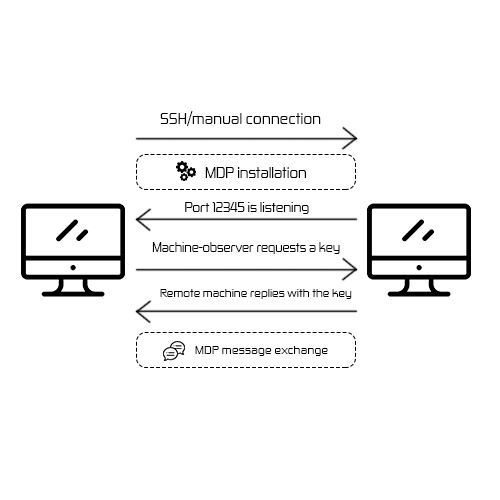

# 🩺 Machine Diagnostics Protocol MDP

Currently supported remote OS:
Ubuntu 14.04+

# Structure of MDP protocol


- The machine needs SSH opened(or some kind to transfer all files)
- Upon the ssh establishment, script installs necessary dependencies (python, pip, etc)
- After the installation of dependencies it installs the autostart script in upstart/systemctl
- The MDP script opens socket on port 12345 and sends/listens to UDP packets, which contain the JSON data
- On the first run, the unique key is generated and propagated with the first message for secure connection over MDP
- THe key for each machine is stored on the monitoring machine in .known_machines directory in the way of `<ip_of_machine>.txt`
- If the key matches the remote machine, script parses JSON array of machine operations and processes them
- After the processing it sends it over UDP to the monitoring host over time
<table><thead><tr>
<td>
From controlling machine to controlled
</td>
<td>
From controlled machine to controlling
</td>
</tr></thead><tr><td>

```json
{
  "key": <key>,
  "version": "1.0",
  "operations": [],
  "cluster_info": {

  }
}
```

</td><td>

```json
{
    "status": true|false,
    "version": "1.0",
    "operations": [],
    "cluster_info": {

    }
}
```

</td></tr></table>

# MDP operations

The list of operations is coming in the JSON format, therefore, you need to decide, how to name your function and place it in the mdp_operations subfolder and provide a docstring to method, so it will give you a hint

# To activate cluster
In order to activate cluster mode on the machine, you need to send the following message to the machine:

```json
{
  // rest of fields
  "cluster_info": {
    "cluster_machines": [
      "192.168.33.10",
      "192.168.33.15",
      // rest of IP addresses
    ],
    "cluster_mode": [
      {
        "name": "sync_folders",
        "folder": "/uploaded_files"
      }
    ]
  }
  // rest of fields
}
```

Answer from the machine will look like this: 

```json
{
  // rest of fields
  "cluster_info": {
    "cluster_machines": <ip_of_added_machine>,
    "machine_mode": [
      {
        "name": "sync_folders",
        "performance": 1-9
      }
    ]
  }
  // rest of fields
}
```

# Important notes

As the minimum Ubuntu version is 14.04, the default python interpreter is 3.4.3 in that distribution. Therefore, keep in mind to use the syntax, applicable for 3.4 and lower for remote scripts and avoid anything incompatible as `f-strings`, which are the new thing, starting from 3.6

If you are getting errors like "no module named <modulename>", it may be cause by mismatch between your virtual environment and working environment. Then you can try to recreate the virtual environemnt by deleting your folder with virtual environemnt and re-installing all pip packages in that folder

# Legacy notes

Icons used in the diagram are from [Flaticons](https://flaticon.com) and are licensed by their respective owners, 
presented here only for demonstration purposes
